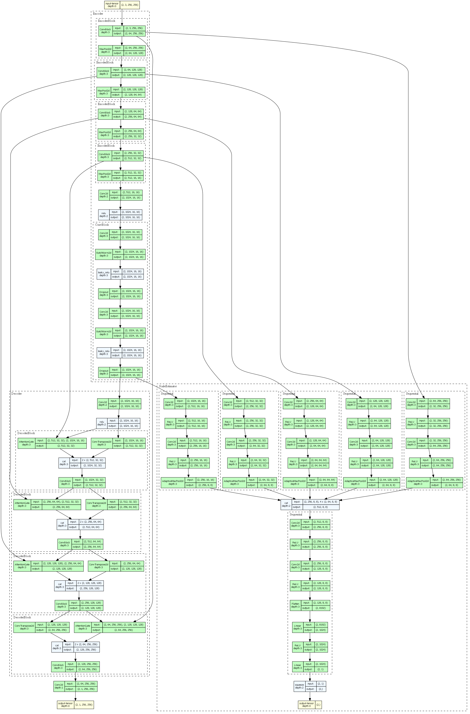
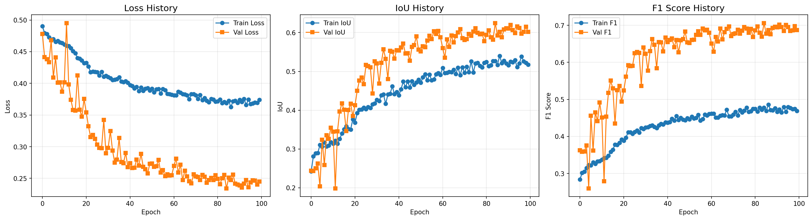
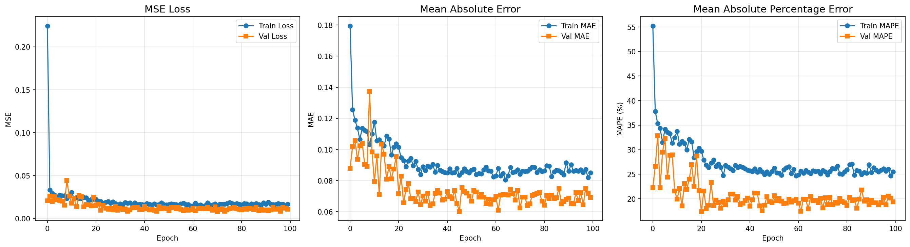
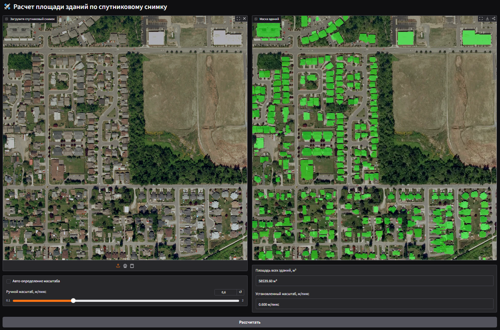

# Satellite Building Area Estimation

Проект посвящён **сегментации спутниковых снимков и вычислению суммарной площади зданий**.
В качестве исходных данных использован датасет **Inria Aerial Image Labeling Dataset**:
[https://project.inria.fr/aerialimagelabeling](https://project.inria.fr/aerialimagelabeling)

Основные задачи проекта:

- бинарная сегментация зданий на спутниковых снимках;
- автоматическое определение масштаба изображения (м/пиксель);
- расчёт суммарной площади застроек;
- интерактивное приложение для инференса.

---

## Оглавление

- [Подготовка данных и обучение](#подготовка-данных-и-обучение)
  - [Датасет](#датасет)
  - [Патчинг изображений](#патчинг-изображений)
  - [SatelliteDataset](#satellitedataset)
  - [Взвешивание пикселей (Distance Transform)](#взвешивание-пикселей-distance-transform)
  - [Аугментации](#аугментации)

- [Модель сегментации](#модель-сегментации)
- [Модель определения масштаба](#модель-определения-масштаба)
- [Обучение](#обучение)
- [Приложение](#приложение)
- [Структура проекта](#структура-проекта)
- [Инструкция по запуску](#инструкция-по-запуску)

---

## Подготовка данных и обучение

### Датасет

Использован **Inria Aerial Image Labeling Dataset**, состоящий из:

- спутниковых RGB-снимков;
- бинарных масок зданий (ground truth).

Характеристики данных:

- формат файлов: `TIFF`;
- размер изображений: **5000 × 5000 пикселей**;
- масштаб: **0.3 м/пиксель**.

---

### Патчинг изображений

Из-за большого разрешения исходные изображения были разделены на патчи размером
**1024 × 1024 пикселя**. Это позволило:

- уменьшить потребление памяти;
- повысить стабильность обучения;
- использовать случайные кропы и аугментации.

---

### SatelliteDataset

Для работы с данными реализован класс `SatelliteDataset`, который возвращает:

- изображение;
- соответствующую маску;
- масштаб (м/пиксель);
- карту весов пикселей (только для обучающей выборки).

Весовая карта используется для усиления вклада пограничных пикселей зданий, так как именно точность границ критична для сегментации.

---

### Взвешивание пикселей (Distance Transform)

Веса пикселей вычисляются на основе **Distance Transform** бинарной маски.

Обозначения:

- ${M(x) \in {0, 1}}$ — бинарная маска зданий;
- ${d\_{in}(x)}$ — расстояние от пикселя до ближайшей границы **внутри** объекта;
- ${d\_{out}(x)}$ — расстояние до ближайшей границы **фона**;
- ${d(x) = d*{in}(x) + d*{out}(x)}$ — комбинированная карта расстояний.

Формула весов:

$$
{
w(x) = \alpha \cdot \exp(-\beta \cdot d(x))
}
$$

После этого веса нормализуются и сдвигаются:

$$
{
w_{final}(x) = \alpha \cdot \frac{w(x)}{\max(w)} + 1
}
$$

Используемые параметры:

- ${\alpha = 2.0}$
- ${\beta = 1.0}$

Таким образом, наибольшие веса получают пиксели, расположенные вблизи границ зданий.

---

### Аугментации

Для повышения обобщающей способности модели применялись следующие аугментации.

#### Масштабирование

Исходное изображение масштабируется с случайным **zoom factor** в диапазоне от **0.25 до 2**.

Это приводит к изменению масштаба изображения:

- от **0.15 м/пиксель**
- до **1.2 м/пиксель**

После масштабирования из изображения вырезается случайный кроп размером
**256 × 256 пикселей**.

#### Геометрические преобразования

- Horizontal Flip (p = 0.5)
- Vertical Flip (p = 0.5)
- Random Rotate 90° (p = 0.5)

#### Фотометрические преобразования

- Random Brightness / Contrast **или**
- Random Gamma
  (одна из трансформаций, p = 0.5)

#### Шум и размытие

- Gaussian Noise (p = 0.2)
- Blur (p = 0.2, kernel ≤ 3)

---

## Модель сегментации

Модель сегментации основана на архитектуре **U-Net**.

### Архитектура

**Энкодер**:

- 4 блока;
- каждый блок: `Conv → Conv → MaxPool`;
- глубина feature maps:
  - 64 → 128 → 256 → 512.

**Боттлнек**:

- самый глубокий уровень представления признаков.

**Декодер**:

- 4 блока;
- `ConvTranspose → Conv → Conv`;
- глубина feature maps уменьшается в 2 раза на каждом уровне;
- используется skip-connection с соответствующим уровнем энкодера.

На выходе — **логиты бинарной маски зданий**.

### Attention Gate

Для улучшения качества сегментации добавлены **Attention Gates**, архитектура которых взята из статьи:
[https://arxiv.org/pdf/1804.03999](https://arxiv.org/pdf/1804.03999)

Attention Gate позволяет:

- подавлять нерелевантные признаки в skip-connection;
- усиливать вклад информативных регионов изображения.

---

## Модель определения масштаба

Модель оценки масштаба работает **совместно с энкодером модели сегментации** и может использоваться опционально.

### Архитектура

- Используются все skip-connection и боттлнек сегментационной модели;
- к каждому признаковому тензору применяется `AdaptiveMaxPool` → **8 × 8**;
- все тензоры конкатенируются;
- итоговая глубина: **512 каналов**.

Использование адаптивного пулинга позволяет работать с изображениями произвольного размера.

Далее:

- 2 сверточных слоя;
- Flatten;
- 2 Linear слоя.

Выход модели — одно вещественное число, соответствующее масштабу (м/пиксель).



---

## Обучение

### Разделение данных

- обучающая выборка: **85%**
- валидационная выборка: **15%**

### Параметры

- batch size:
  - train: **8**
  - val: **1**

---

### Обучение модели сегментации

- количество эпох: **100**
- функция потерь:
  $${
  L = 0.6 \cdot Dice + 0.4 \cdot Focal_{DT}
  }$$
  где Focal Loss взвешен пиксельными весами, вычисленными с помощью Distance Transform.

Метрики:

- IoU
- F1-score

Сохранялась модель с лучшим **IoU** на валидации.

Лучший результат:

- **IoU = 0.6247**
- эпоха: **85**



---

### Обучение модели масштаба

- энкодер сегментационной модели заморожен;
- используется **MSE loss**;
- метрики:
  - MAE
  - MAPE.

Сохранялась лучшая модель по **MSE** на валидации.

Лучший результат:

- **MSE = 0.008301**
- эпоха: **71**



---

## Приложение

После обучения моделей было создано приложение с использованием **Gradio**.

Функциональность:

- загрузка спутникового снимка;
- сегментация зданий;
- вычисление суммарной площади застроек;
- определение масштаба:
  - автоматически (через модель);
  - вручную (ползунок).

Интерфейс:

- левое окно — входное изображение;
- правое окно — изображение с выделенными зданиями (зелёный цвет);
- ниже отображаются:
  - суммарная площадь;
  - используемый масштаб.

Если доступен GPU, модели автоматически выполняются на нём.



---

## Структура проекта

```
satellite_building_area
├── models
│   ├── scale_estimator.pth
│   └── segmentation.pth
├── src
│   ├── __init__.py
│   ├── config.py
│   ├── models.py
│   └── predict.py
├── app.py
├── requirements.txt
└── test.py
```

---

## Инструкция по запуску

1. Создание виртуального окружения и установка необходимых пакетов:

```bash
cd satellite_building_area
py -3.11 -m venv .venv
.venv\Scripts\activate
py -m pip install -r requirements.txt
```

2. Загрузите архив с моделями по [ссылке](https://drive.google.com/file/d/1lDV1yQB4oLlp6CJb6fM8-VLdqGCY3Tbw/view) и разархивируйте его в папку **models**
3. Проверка доступности GPU:

```bash
py test.py
```

4. Запуск приложения:

```bash
py app.py
```

5. После запуска открыть в браузере:

```
http://127.0.0.1:7860
```
